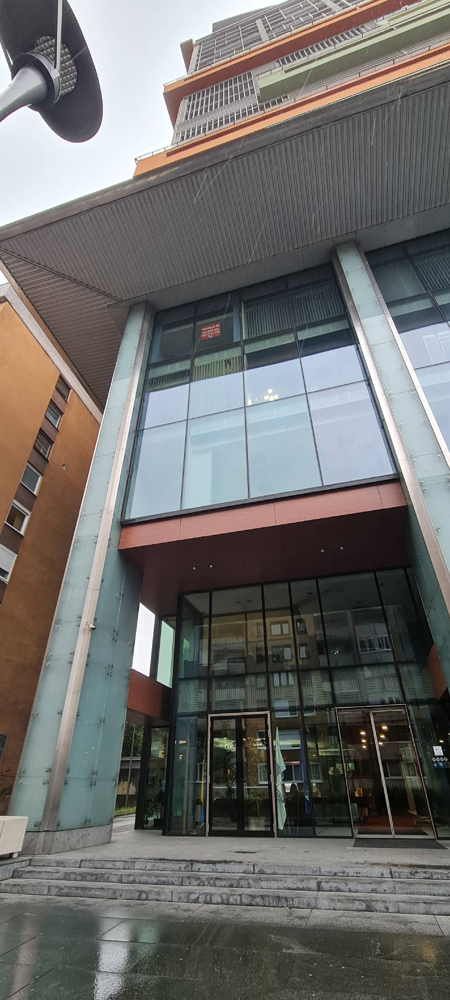

==========================
Frequently Asked Questions
==========================

**1. Where is the entrance to the office located?**

We are located at **Milana Preloga 12a**, on the 11th floor. Please see the picture attached below for further clarification.

**2. How to Format an SSD Using the Command Prompt?**

For detailed instructions on how to format an SSD using the command prompt, refer to this guide:  
`Tom's Hardware - How to Format an SSD Using Command Prompt <https://www.tomshardware.com/news/format-hard-drive-command-prompt,37632.html>`_

**3. How to Install a Package Using Linux Terminal**

To install a package on a Linux system using the terminal, use the following command:

.. code-block:: bash

   sudo dpkg -i packagename.deb

**4. How to Create an SSH Key for Git?**

To add an SSH key for Git, use the following command:

.. code-block:: bash

   ssh-add ~/.ssh/id_rsa

**5. Problems with the System Clock When Switching from Ubuntu to Windows**

If you are experiencing issues with the system clock when switching between Ubuntu and Windows, you can fix this by typing the following command in the Linux terminal:

.. code-block:: bash

   timedatectl set-local-rtc 1

This will ensure that the next time you set the time on Windows, it won't be out of sync with Ubuntu.
